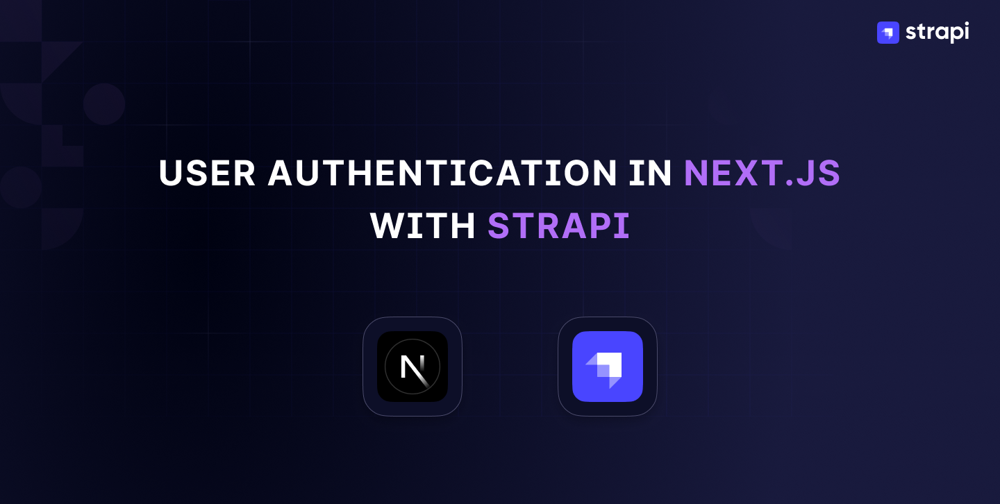

<!--# nextjs-authentication-using-strapi-and-next-auth
Application show how Next.js can be authenticated using Strapi and NextAuth. -->

# User Authentication in Next.js with Strapi



## Description

This repository contains the source code for the article: [User Authentication in Next.js with Strapi](https://strapi.io/blog/user-authentication-in-next-js-with-strapi), written for [Strapi's Blog](https://strapi.io/blog)

## Prerequisites

To test out the source code you will need the following:
- [Node.js LTS v18 or v20](https://nodejs.org)
- [Google Account](https://google.com)

## Getting Started

Clone the repository.
```bash
git clone https://github.com/Marktawa/nextjs-authentication-using-strapi-and-next-auth.git
```

## Strapi Setup

Install dependencies.
```bash
cd nextjs-authentication-using-strapi-and-next-auth/backend
```

```bash
npm install
```

Set up Environment variables.
```bash
cp .env.example .env
```

Create admin user with email `chef@strapi.io` and password `Gourmet1234`.
```bash
npm run strapi admin:create-user -- --firstname=Kai --lastname=Doe --email=chef@strapi.io --password=Gourmet1234
```

Run Strapi server.
```bash
npm run develop
```

Login to your Strapi admin by visiting [localhost:1337/admin](http://localhost:1337/admin) using the admin email and password you created earlier.


Clicking on **Login** gives you the Strapi Admin Dashboard Home page:


## Next.js Setup

Open up your project folder, `nextjs-authentication-using-strapi-and-next-auth` in a new terminal session.

Install dependencies.
```bash
cd nextjs-authentication-using-strapi-and-next-auth/frontend
```

```bash
npm install
```

Set up Environment variables.
```bash
cp .env.example .env
```

## Google OAuth Setup

[Create a Google OAuth client ID ](https://console.developers.google.com/apis/credentials/oauthclient) by visiting [this link.](https://console.developers.google.com/apis/credentials/oauthclient)

On completion, you should have a Client ID and a Client Secret:


Update `.env` in your Next.js folder, `nextjs-authentication-using-strapi-and-next-auth/frontend`,  with your  Client ID: `GOOGLE_CLIENT_ID` and Client secret: `GOOGLE_CLIENT_SECRET`.

## Test out code

Run the following command inside the Next.js folder, `nextjs-authentication-using-strapi-and-next-auth/frontend` to launch the app.
```bash
npm run dev
```

Visit [localhost:3000](http://localhost:3000/) to view the Sign In page.


Log in using your Google account by clicking **Sign In**. Once signed in, you can access the app:


## Author

Mark Munyaka  
[dev.to/markmunyaka](https://dev.to/markmunyaka)